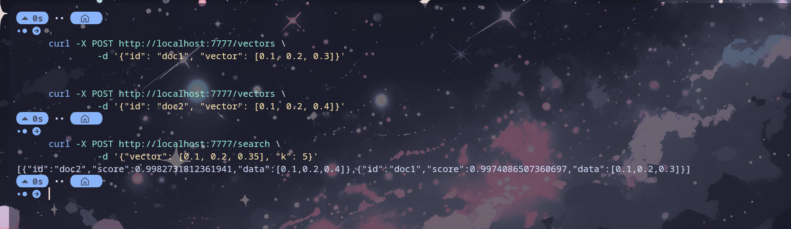

# govecDB

**govecDB** is a lightweight, high-performance, in-memory Vector Database built from scratch in Go. It supports dense vector embedding storage, cosine similarity search, and thread-safe persistence.

Designed as a systems programming project to understand the internals of vector stores like Pinecone or Weaviate.

## 🚀 Features

- **Core Arithmetic:** Implements Cosine Similarity and Euclidean Magnitude calculations.
- **In-Memory Storage:** Uses Go Maps for $O(1)$ Insert and Delete operations.
- **Search:** Performs k-Nearest Neighbor (k-NN) search using linear scanning and score-based sorting.
- **Concurrency Safe:** Implements `sync.RWMutex` to handle concurrent Reads (Search/Save) and Writes (Insert) efficiently.
- **Persistence:** Background snapshotting to disk using Go's binary `encoding/gob` format.
- **HTTP API:** REST-like JSON endpoints for inserting and querying vectors.



## 🛠️ Architecture

### Data Structure

The core storage engine moves away from simple slices to a Hash Map structure to optimize lifecycle management:

- **Storage:** `map[string]*VectorPoint`
- **Optimization:** Magnitudes are pre-calculated upon insertion to avoid repeated `sqrt` operations during search queries (O(1) lookup vs O(D) calculation).

### Concurrency Model

The system uses a **Reader-Writer Lock** (`sync.RWMutex`):

- **Search & Save:** Acquire `RLock()` (Multiple readers allowed in parallel).
- **Insert & Delete:** Acquire `Lock()` (Exclusive access).
- **Snapshotting:** A background Goroutine wakes up every 5 minutes to dump the memory state to `vector.gob` without blocking search traffic.

## 📦 Installation & Usage

1. **Clone the repository**

   ```bash
   git clone https://github.com/SyedAsadK/govecDB.git
   cd govecDB
   ```

2. **Run the Server**

   ```bash
   go run main.go
   ```

   _Server will start on port `:7777`_

## 🔌 API Reference

### 1\. Insert a Vector

Adds a new vector to the database. If the ID exists, it returns an error (idempotency check).

- **Endpoint:** `POST /vectors`
- **Body:**

  ```json
  {
    "id": "doc_1",
    "vector": [0.12, 0.45, 0.88, -0.23]
  }
  ```

**cURL Example:**

```bash
curl -X POST http://localhost:7777/vectors \
  -H "Content-Type: application/json" \
  -d '{"id": "doc_1", "vector": [1.0, 2.0, 3.0]}'
```

### 2\. Search Vectors

Finds the top `k` most similar vectors to the query vector.

- **Endpoint:** `POST /search`
- **Body:**

  ```json
  {
    "vector": [0.12, 0.45, 0.88, -0.23],
    "k": 3
  }
  ```

**cURL Example:**

```bash
curl -X POST http://localhost:7777/search \
  -H "Content-Type: application/json" \
  -d '{"vector": [1.0, 2.0, 3.1], "k": 2}'
```

**Response:**

```json
[
  {
    "id": "doc_1",
    "score": 0.998,
    "data": [1.0, 2.0, 3.0]
  }
]
```

## 🧠 Future Roadmap

- **Indexing:** Move from Brute Force ($O(N)$) to Approximate Nearest Neighbor (ANN) using HNSW or IVF for large datasets.
- **WAL (Write Ahead Logging):** Implement an append-only log for durability guarantees between snapshots.
- **Sharding:** Distribute data across multiple nodes.
- **Quantization:** Compress vectors to `int8` to reduce memory usage.
